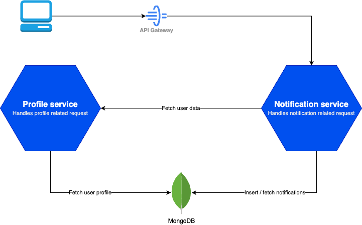

<a id="readme-top"></a>

<!-- TABLE OF CONTENT -->

## Table of Content

  <ol>
    <li>
      <a href="#about-the-project">About The Project</a>
      <ul>
        <li><a href="#built-with">Built With</a></li>
      </ul>
    </li>
    <li>
      <a href="#getting-started">Getting Started</a>
      <ul>
        <li><a href="#prerequisites">Prerequisites</a></li>
        <li><a href="#steps-to-get-it-running">Steps to get it running</a></li>
      </ul>
    </li>
    <li><a href="#usage">Usage</a></li>
    <li><a href="#roadmap">Roadmap</a></li>
    <li><a href="#acknowledgments">Acknowledgments</a></li>
  </ol>

<!-- ABOUT THE PROJECT -->

## About The Project

This project is a NestJS Project that simply acts as an API Gateway that allows other microservice to interact with it. The other microservices for this example project are:

<ol>
    <li>
    <a href="https://github.com/AldroidOng/briohr-profile-service">Profile service </a> (Service meant for serving user/company profile related request): 
  </li>
  <li>
    <a href="https://github.com/AldroidOng/briohr-notification-service">Notification service</a> (Service meant for serving notification related request)
  </li>
</ol>

It also uses the git submodule (<a href="https://github.com/AldroidOng/briohr-shared">shared</a>) to share common types and services across these repositories.

If using along side with the microservices (profile service and notification service), the architecture diagram would look like below:

<div align="center">
  
</div>

<p align="right">(<a href="#readme-top">back to top</a>)</p>

### Built With

- [![Nest][Nest.js]][Nest-url]

<p align="right">(<a href="#readme-top">back to top</a>)</p>

<!-- GETTING STARTED -->

## Getting Started

### Prerequisites

Ensure you have below software installed on your machine:

<ol>
    <li>
    <a href="https://www.docker.com/">Docker</a>
  </li>
  <li>
    <a href="https://git-scm.com/">Git</a>
  </li>
</ol>

### Steps to get it running

1. Create a working directory that you wish to store your services. Exmaple of folder for reference: Briohr
2. Clone the following repositories into the working directory you created (Briohr)
   ```sh
   git clone https://github.com/AldroidOng/briohr-api-gateway.git
   git clone https://github.com/AldroidOng/briohr-notification-service.git
   git clone https://github.com/AldroidOng/briohr-profile-service.git
   ```
3. Inside the working directory (Briohr), create a `docker-compose.yml` and insert the following code:

   ```yml
   version: '3.8'
    services:
      api-gateway:
        build: ./api-gateway
        ports:
          - "3000:3000"
        depends_on:
          - notification-service
          - profile-service
        networks:
          - app-network
        environment:
          - MONGODB_URI=mongodb://mongo:27017/briohr
          - NOTIFICATION_MICROSERVICE_HOST=notification-service
          - NOTIFICATION_MICROSERVICE_PORT=3001

      notification-service:
        build: ./notification-service
        ports:
          - "3001:3001"
        networks:
          - app-network
        environment:
          - MONGODB_URI=mongodb://mongo:27017/briohr
          - NOTIFICATION_MICROSERVICE_HOST=notification-service
          - NOTIFICATION_MICROSERVICE_PORT=3001
          - PROFILE_MICROSERVICE_HOST=profile-service
          - PROFILE_MICROSERVICE_PORT=3002

      profile-service:
        build: ./profile-service
        ports:
          - "3002:3002"
        networks:
          - app-network
        environment:
          - MONGODB_URI=mongodb://mongo:27017/briohr
          - PROFILE_MICROSERVICE_HOST=profile-service
          - PROFILE_MICROSERVICE_PORT=3002

      mongo:
        image: mongo:latest
        ports:
          - "27017:27017"
        networks:
          - app-network
        volumes:
          - mongo_data:/data/db

    networks:
      app-network:
        driver: bridge

    volumes:
      mongo_data:
   ```

4. Open the terminal pointing to the working directory and run

   ```sh
   docker-compose build
   docker-compose up -d
   ```

5. The services should now be up and running. You may proceed to inspect the containers running using the <a href="https://www.docker.com/products/docker-desktop/">Docker Desktop</a> or by inputting the below command:

   ```sh
   docker ps
   ```

<p align="right">(<a href="#readme-top">back to top</a>)</p>

<!-- USAGE EXAMPLES -->

## Usage

To help you get started with the API, you can import the Postman collection by:

1. Acessing it via URL (**[Postman Collection URL](https://www.postman.com/technical-astronaut-84109455/workspace/nestjs-microservice/collection/21714473-e660a383-0fde-4494-8c95-f45a3ac2b1fc?action=share&creator=21714473)**) OR

2. Forking it into your own workspace by clicking on the Run In Postman button below:

   [](https://app.getpostman.com/run-collection/21714473-e660a383-0fde-4494-8c95-f45a3ac2b1fc?action=collection%2Ffork&source=rip_markdown&collection-url=entityId%3D21714473-e660a383-0fde-4494-8c95-f45a3ac2b1fc%26entityType%3Dcollection%26workspaceId%3Df6278dc9-3a37-470f-97de-975c713ca180)

Then, you may test the connection to the notification service by running the GET localhost:3000/notification/test

To begin testing on the other services, you will firstly need to run GET localhost:3000/notification/seed to populate some data into the MongoDB respective collections.
The list of username that you can used when calling the respective API that requires them are:

1. Email and UI User
2. Email Only User
3. UI Only User

and the validate notificationType that you can when calling the POST localhost:3000/notification are:

1. happy-birthday
2. leave-balance-reminder
3. monthly-payslip

<!-- ROADMAP -->

## Roadmap

- [ ] Enhance to catch actual error message thrown from one service to another

See the [open issues](https://github.com/othneildrew/Best-README-Template/issues) for a full list of proposed features (and known issues).

<p align="right">(<a href="#readme-top">back to top</a>)</p>

<!-- CONTRIBUTING -->

## Contributing

Contributions are what make the open source community such an amazing place to learn, inspire, and create. Any contributions you make are **greatly appreciated**.

If you have a suggestion that would make this better, please fork the repo and create a pull request. You can also simply open an issue with the tag "enhancement".
Don't forget to give the project a star! Thanks again!

1. Fork the Project
2. Create your Feature Branch (`git checkout -b feature/AmazingFeature`)
3. Commit your Changes (`git commit -m 'Add some AmazingFeature'`)
4. Push to the Branch (`git push origin feature/AmazingFeature`)
5. Open a Pull Request

<p align="right">(<a href="#readme-top">back to top</a>)</p>

<!-- MARKDOWN LINKS & IMAGES -->
<!-- https://www.markdownguide.org/basic-syntax/#reference-style-links -->

[Nest.js]: https://img.shields.io/badge/nestjs-E0234E?style=for-the-badge&logo=nestjs&logoColor=white
[Nest-url]: https://nestjs.com/
